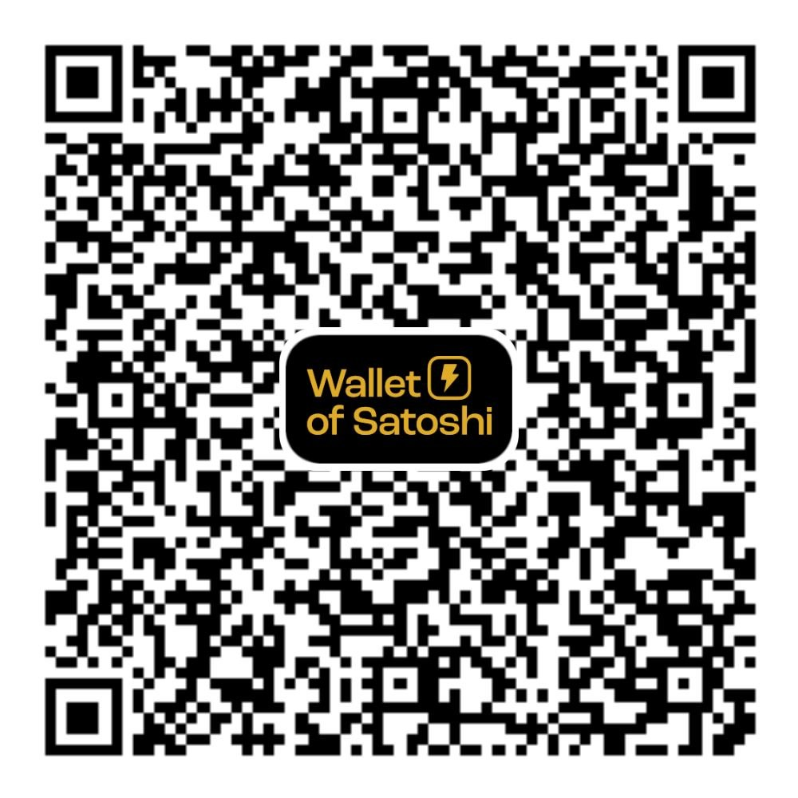
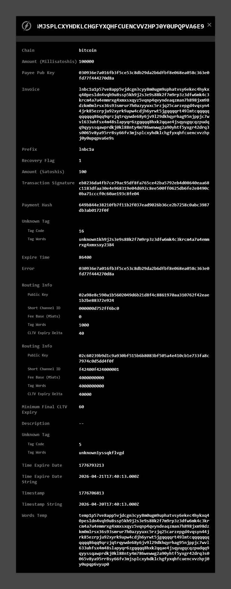
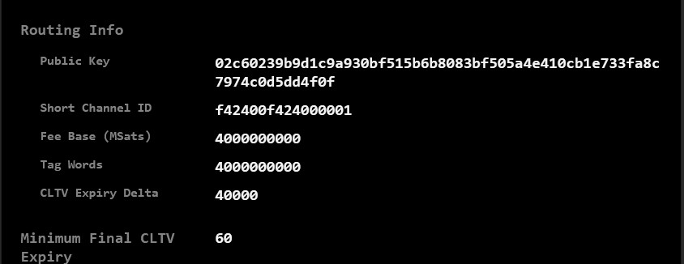
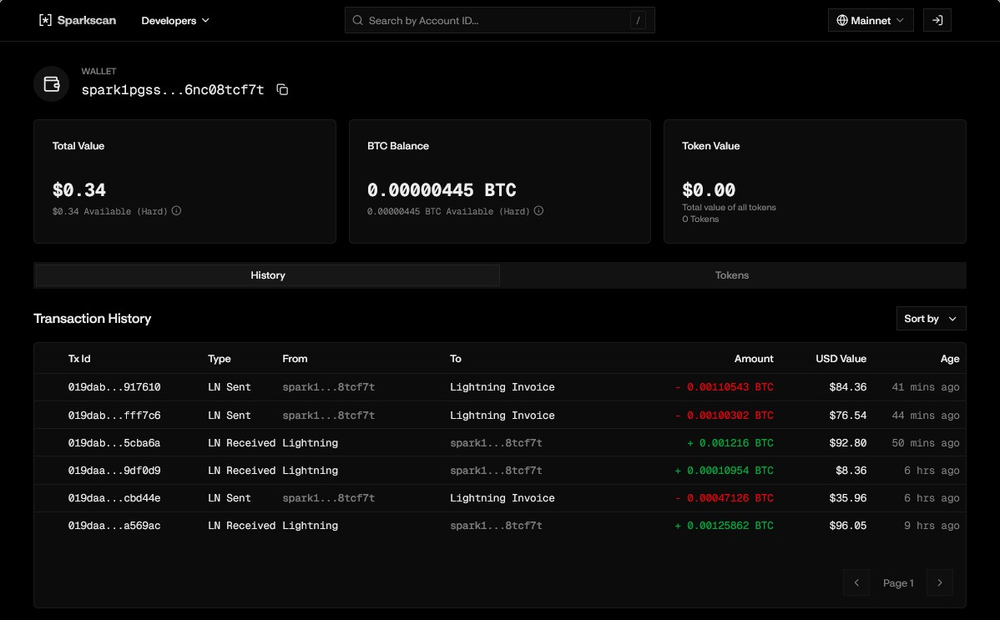
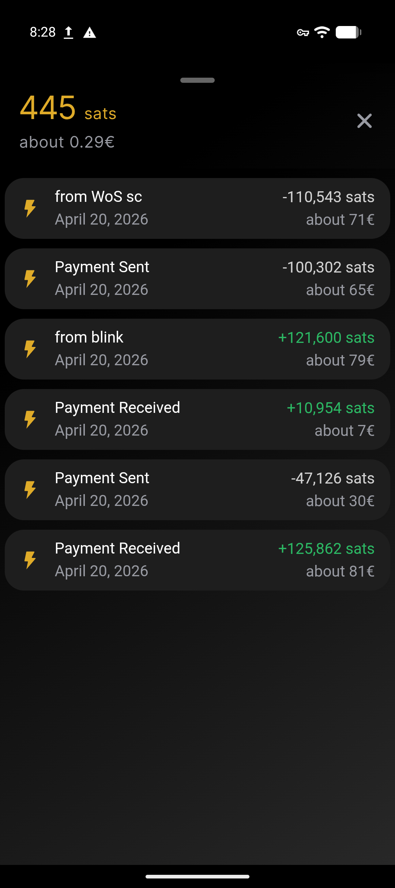

# Wallet of Satoshi Self-Custody

## Gennaio 2024

|                                                                                                                                                                                                                                                                                                                                                                                                                                                                                                                                                                                                    |                                       |
| :--------------------------------------------------------------------------------------------------------------------------------------------------------------------------------------------------------------------------------------------------------------------------------------------------------------------------------------------------------------------------------------------------------------------------------------------------------------------------------------------------------------------------------------------------------------------------------------------------- | :-------------------------------------: |
| *Wallet of Satoshi*, uno dei principali portafogli bitcoin e Lightning Network al mondo,  annuncia il suo ritiro dall’App Store di Apple e dal Play Store di Google negli Stati Uniti,  sollevando interrogativi sulle sfide di conformità e sul futuro dei servizi di criptovaluta nell’ambito di rigidi regimi normativi.  Inizialmente promette di lasciare l'app in funzione per permettere di prelevare i fondi.  Peccato che questa possibilità sia durata per poco tempo e che, avendo tolto l'applicazione dagli store......,  in molti siano rimasti a bocca asciutta. |  |

Un po' per questo motivo ed un po' perché era custodial, ho sempre sconsigliato l'utilizzo di questa app. 
Ora, però, *Wallet of Satoshi*, per non sottostare alle leggi Europee (MICAR, DAC8 etc etc etc) ha annunciato la trasformazione in **Wallet Self-Custody**.

---

### WoW, che bella novità!

Questo è quello che in genere sento dire, purtroppo non è così. 
Per quanto possibile **WoS** ha peggiorato la situazione. 
L'introduzione del Self-Custody sembrerebbe una novità fantastica, ma, come vedremo, in questo specifico caso non lo è. 
Vi spiegherò il motivo in seguito perchè prima dobbiamo fare un passo indietro.

## il Trilemma

 
Sicuramente tutti avrete sentito parlare del Trilemma. 
In pratica, questa teoria, sostiene che solo due dei tre vertici possano essere implementati in una Blockchain. 
Nel caso di Bitcoin [^1] (l'unica vera Blockchain) la Decentralizzazione e la Sicurezza sono stati implementanti a discapito di altre cose. 
A Bitcoin spesso viene rimproverata la *scarsa privacy* delle transazioni. 
Infatti, per garantire la sicurezza, *Bitcoin non è anonimo*, Bitcoin è **pseudonimo**, ma soprattutto è tutto tracciabile; interrogando la mempool, infatti, possiamo seguire a ritroso una qualsiasi transazione fino ad arrivare al bitcoin generato come coinbase. 
Altra cosa che si riprovera a Bitcoin è *la lentezza delle transazioni*. Sempre per garantire la Sicurezza delle transazioni i blocchi vengono validati con la Proof of Work e, come prevede il protocollo, tramite la difficulty adjustment, viene validato un nuovo blocco circa ogni 10 minuti.

### Lightning Network

Per questo motivo, per **scalare il protocollo**, sono stati costruiti layer superiori. Il più conosciuto (qualcuno sostiene che sia l'unico) è **Lightning Network**. 
Già il nome ci fa capire su cosa punta questo protocollo: **sulla velocità**, ma, come vedremo, non è l'unica caratteristica importante.

Non sono quì a parlare del funzionamento di questo protocollo, ma serve farvi capire alcune suo caratteristiche per poter poi spiegare la pericolosità del sistema che ha adottato ora WoS.

Se in Bitcoin vi è una traccia indelebile di tutto quello che accade, in Lightning Network, invece, tutto scompare una volta chiuso il canale[^2]. 
Questa è una caratteristica importante che viene spesso utilizzata per rompere la tracciabilità di una transazione Bitcoin. 

Visto che questo è un concetto che può sembrare complesso, provo a spiegarmi in maniera semplice con un esempio prteoricotico.

> *Pippo* riceve dei bitcoin on chain da *Gargamella*, ma non ha piacere che *Gargamella* veda come lui utilizzerà quelle monete, così cerca un modo di rompere la tracciabilità che è intrinseca a Bitcoin.
>
> Ci sono vari modi per rompere questa tracciabilità, ma quello che prendiamo ora in considerazione è lo **swap su Lightning Network**.
>
> Cosa farà quindi *Pippo*? Prenderà i bitcoin ricevuti da *Gargamella* e tramite un servizio di swap [^3] li trasformerà in Liquidità di un suo wallet Lightning. 
> Visto che si tratta dei suoi soldi (e magari non sono nemmeno pochini), *Pippo* cercherà un wallet Lightning Self-Custodial che gli permette di custodire personalmente i fondi senza doversi rivolgere ad un ente terzo a cui dovrebbe devolvere la sua fiducia. 
> Padrone dei suoi fondi, potrà decidere se usarli nel circuito LN, oppure attendere il momento opportuno per spostarli altrove.
>
> In questo caso, appena sarà pronto, il nostro *Pippo*, effettuerà l'operazione al contrario riportando i suoi fondi OnChain. *Pippo* ha già dimostrato di tenere alla sua privacy e alla custodia dei propri fondi, quindi utilizzerà un Wallet assolutamente Self-Custody di cui ha il pieno controllo.
>
> *Gargamella* il curiosone, controllando la transazione in mempool vedrà i fondi di *Pippo* sparire senza sapere dove siano andati a finire perchè *Pippo* li ha trasferiti su un altro wallet, magari su un cold wallet per utilizzarli come riserva o magari su di un hot wallet perchè vuole spenderli.

Con la speranza che questo esempio vi sia chiaro, andiamo a vedere come possa essere rilevante in questa guida su WoS.

Per l'amor del vero, devo informarvi che gli SWAP hanno dei costi (in genere ogni swap ha uno 0,5% di fee), ma se ne avete compreso l'importanza, potrete valutare liberamente se questo costo sarà adeguato ai benefici.

Ora, però, andiamo a conoscere un altro attore di questa situazione.

## *Spark

Che cos'è **Spark**? 
Iniziamo a vedere come si autodefiniscono sul sito [spark.money](https://spark.money):

> Spark is the fastest, cheapest, and most UX-friendly way to build financial apps and launch assets natively on Bitcoin. It’s a **Bitcoin L2** that lets developers move Bitcoin and Bitcoin-native assets (including stablecoins) instantly, at near-zero cost, while staying fully connected to Bitcoin’s infrastructure.

Si definiscono un altro Layer 2 (ricordo che anche Lightning è un L2) e il loro intento è di spostare la liquidità in stablecoin tra finanza decentralizzata, piattaforme centralizzate e asset reali tokenizzati.

**WoS Self-Custody** si appoggia a Spark per gestire i vostri fondi. 
In pratica, ora WoS è un wallet spark, ma che vi permette però di operare solo sul circuito di Lightning Network. 
WoS non è l'unico wallet LN che si appoggia a questa tecnologia, ma, ad oggi, mi risulta che sia l'unico ad avere questa vulnerabilità.

L'utilizzo di *sidechain* come Spark o Liquid, permette di operare nel circuito Lightning Network senza doversi occupare di gestire i canali.

## WoS + Spark perchè questa accoppiata deve farci paura

Veniamo dunque al nostro Wallet of Satoshi che ora nella versione Self-Custody si appoggia a Spark.

Per farvi comprendere i rischi che si corrono, ho pensato di fare un esempio pratico.

Ho creato un wallet con WoS self custodial, mi sono fatto mandare qualche fondo da qualche conoscente e poi li ho rimandati indietro in maniera un po' randomica.

A questo punto sono in possesso di un wallet con una serie di operazioni sopra. 
Ci saranno dei movimenti e ci sarà un saldo.

Mettiamo che ora qualcuno mi debba inviare dei fondi. Per poterli ricevere, devo creare una invoice come questa che segue:

`lnbc1u1p57ve8app5vjdcgn3cyy8m0ugm9uphatvsy6ekec4hykxq40pesldn4vqh9u8ssp5kh9j2s3e9s88k2f7m9rp3z3dfw6mk4c3krcm4a7u4emmrxg4xmxsxqyz5vqnp4qvyndeaqzman7h898jxm98dzkm0mlrsx36s93smrur7h0azyyuxc5rzjq25carzepgd4vqsyn44jrk85ezrpju92xyrk9apw4cdjh6yrwt5jgqqqqrt49lmtcqqqqqqqqqqq86qq9qrzjqtrqywde68y6jv9l29dkhqyrhag95njppjc7wvl633uhfsx4m48slapyqr6zgqqqq8hxk2qqae4jsqyugqcqzpudqq9qyyssqawprdkj0kl88nty4m786wewwg2a90yhtf5yxgr42drq3s0065v8ya95rr8sy66fv3mjsplcxyhdklchgfyxqhfcuencvvzhpj0y0upqpva6e9s`

Ora, con questa invoice, basta andare su un sito che decodifichi invoice Lightning come [lightningdecoder.com](https://lightningdecoder.com) ed inserire l'invoice che ho incollato quì sopra. 
Dalla invoice, vengono decodificati un numero ginormico di dati. La schermata è decisamente lunga, piena di sigle, codici, numeri e tante alte informazioni:

Potete vedere tantissime informazioni sulla invoice. 
Importo, FEE, Timestamp, Scadenza e ancora tante altre informazioni. 
Di tutta questa enorme pagina di dati, dobbiamo concentrarci solo si questo piccolo blocco:

Il dato che ci interessa è la **Public Key**:

`02c60239b9d1c9a930bf515b6b8083bf505a4e410cb1e733fa8c7974c0d5dd4f0f`

Ora prendiamo questa stringa esadecimale ed andiamo ad inserirla in un sito che esplora l'ecosistema Spark, nel mio esempio ho usato [sparkscan.io](https://sparkscan.io). 
Incollando la **Public Key** identificata sopra, possiamo visualizzare una **AGGHIACCIANTE INFORMAZIONE!!**. Tutte le transazioni di questo Wallet ed il suo saldo, sono esposti in chiaro a chiunque riceva una mia invoice.

La controprova sta nello screenshot che segue. 
Come potete vedere, su sparkscan.io sono visibili tutti i movimenti ed il saldo presente sul wallet.

## Conclusioni

Ho deciso di scrivere questa guida, per cercare di aprire gli occhi a tutte quelle persone che ignorano la pericolosità di questa falla in WoS. 
Mi è capitato di parlarne in gruppi Telegram e venire deriso, quasi insultato e accusato di provare piacere nel seminare il panico.

Quello che però queste persone non riescono a comprendere, è che se presentano Bitcoin come strumento per la sovranità individuale e lo sponsorizzano come strumento pseudonimo, proponendo l'utilizzo di WoS vengono meno a quanto detto in precedenza. 
Mi è stato contestato in maniera veramente aspra che se il barista dovesse scoprire che ho 20 euro sul wallet, non sarebbe assolutamente un problema.

Questa affermazione mi potrebbe anche trovare d'accordo, ma a patto che alla persona a cui si consiglia di utilizzare questo strumento, vengano mostrati tutti i pro ed i contro.

WoS potrebbe continuare ad essere uno strumento per far avvicinare la gente a Bitcoin, ma solo se si mettono dei paletti ben precisi nell'utilizzo.

Mi hanno definito paranoico, ma in Francia, dall'inizio del 2026, gli attacchi fisici, le rapine e i sequestri che coinvolgono persone con possedimenti in Cryptovalute, sono aumentati a dismisura. 
Quindi, perchè dover andare a mostrare ad un bar o ad una persona da cui sto comprando un oggetto pagandolo in satoshi, l'intero transato e saldo del mio wallet? 
WoS lo si utilizza di persona, faccia a faccia. Continuiamo ad essere pseudonimi, ma ci mettiamo la faccia. Diventiamo riconoscibili.

Quindi, al di la del fatto che non mi piace mostrare il contenuto del mio portafoglio al primo che pago, potrei anche valutare l'utilizzo di WoS per piccolissimi pagamenti e con piccolissime ricariche sporadiche, ma **ASSOLUTAMENTE NON VA MAI E POI MAI PRESO IN CONSIDERAZIONE PER TRANSAZIONI MAGGIORI**; sarà anche SELF CUSTODIAL, ma è un Self Custodial che sbandiera ai 4 venti il mio saldo ed il mio transato.

Ma poi, con tutte le alternative FOSS che esistono, perchè proporre una soluzione Closed come WoS? 
Siamo sicuri che proporre tecnologie senza fare un disclaimer su eventuali pericoli nell uso della stessa, sia la soluzione corretta? 
Io diffiderei di chi mi mostra solo un lato della medaglia. Troppo spesso l'ignoranza è stata utilizzata per controllare le masse. 
Spero che questa mia guida possa far aprire gli occhi a qualcuno.

### Ringraziamenti
Innanzitutto devo ringraziare Plak perchè sul suo canale YouTube [Final Step Bitcoin](https://www.youtube.com/@final_step_bitcoin) ha pubblicato il video [WALLET OF SATOSHI SELF-CUSTODY: Sembra privato, ma TUTTI vedono i TUOI MOVIMENTI! Ti spiego come](https://youtu.be/aaHfPL_YoVM?si=GgKAQue7v2RVBiDu) che ha fatto aprire gli occhi su WoS all'Italia capace di comprendere. Lo ringrazio anche per aver condiviso con me parecchio del materiale che ho riportato quì sopra.

Devo poi ringraziare alcuni utenti del gruppo Telegram [Bitcoin EDU Veneto](https://t.me/Bitcoin_Veneto) perchè è stato dopo essere stato da loro attaccato, canzonato, bistrattato e quasi insultato che ho deciso di scrivere questa guida.

Ringrazio tutti quelli che mi hanno aiutato inviando i fondi per le transazioni.
| | |
| :------- | :--------: |
|  Come sempre invito chiunque voglia commentare a farlo liberamente, accetto volentieri C&C che possano arricchire e/o correggere questo scritto. Ho buttato tutto giù di getto, pertanto segnalatemi anche qualsiasi tipo di errore.   Per parlare con me di questa guida, unitevi al gruppo Telegram :link:[ABC del Bitcoin](https://t.me/+GlEaD0WD53BmNGE0).|  |

[^1]: Bitcoin (con l'iniziale maiuscola) indica il protocollo, mentre bitcoin (con l'iniziale minuscola) indica, invece, la moneta.
    
[^2]: Per effettuare una transazione tra due utenti è necessario che i fondi possano passare dall'attore A all'attore B. Questa transizione avviene attraverso ai canali di pagamento.
    
[^3]: SWAP
