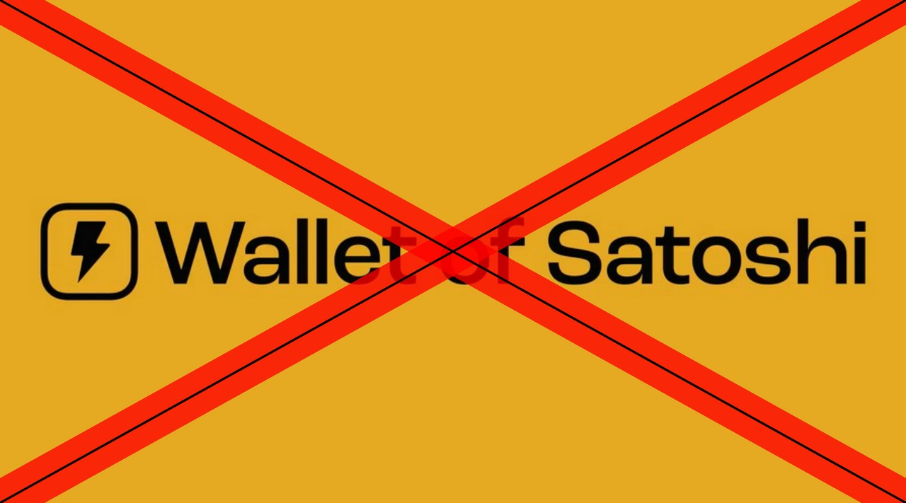
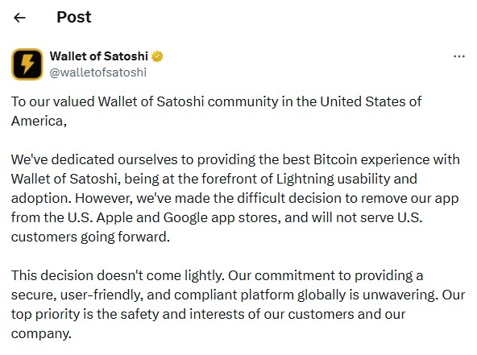
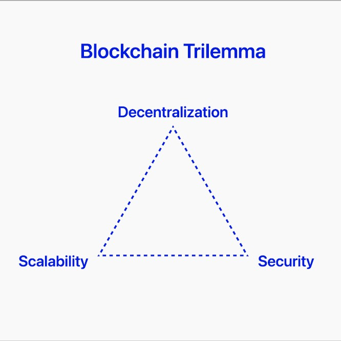

# Wallet of Satoshi Self-Custody

## Gennaio 2024

|   |   |
|:------|:---------:|
|*Wallet of Satoshi*, uno dei principali portafogli bitcoin e Lightning Network al mondo,  annuncia il suo ritiro dall’App Store di Apple e dal Play Store di Google negli Stati Uniti,  sollevando interrogativi sulle sfide di conformità e sul futuro dei servizi di criptovaluta nell’ambito di rigidi regimi normativi.  Inizialmente promette di lasciare l'app in funzione per permettere di prelevare i fondi.  Peccato che questa possibilità sia durata per poco tempo e che, avendo tolto l'applicazione dagli store......,  in molti siano rimasti a bocca asciutta.| |

Un po' per questo motivo ed un po' perché era custodial, ho sempre sconsigliato l'utilizzo di questa app. 
Ora, però, *Wallet of Satoshi*, per non sottostare alle leggi Europee (MICAR, DAC8 etc etc etc) ha annunciato la trasformazione in **Wallet Self-Custody**.
***
### WoW, che bella novità!
Questo è quello che in genere sento dire, purtroppo non è così. 
Per quanto possibile **WoS** ha peggiorato la situazione. 
IL Self-Custody sembrerebbe una novità fantastica, ma, come vedremo, per metterlo in pratica si sono appoggiati ad un servizio che ha creato enormi problemi di privacy. 
Vi spiegherò il motivo in seguito perchè prima dobbiamo fare un passo indietro.

## il Trilemma
 
Sicuramente tutti avrete sentito parlare del Trilemma. 
In pratica, questa teoria, sostiene che solo due dei tre vertici possano essere implementati in una Blockchain. 
Nel caso di Bitcoin [^1] (l'unica vera Blockchain) la Decentralizzazione e la Sicurezza sono stati implementanti a discapito di altre cose. 
A Bitcoin spesso viene rimproverata la *scarsa privacy* delle transazioni. 
Per garantire la sicurezza, *Bitcoin non è anonimo*, Bitcoin è **pseudonimo**, ma soprattutto è tutto tracciabile: interrogando la mempool, infatti, possiamo seguire a ritroso una qualsiasi transazione fino ad arrivare al bitcoin generato come coinbase.  
Altra cosa che si riprovera a Bitcoin è *la lentezza delle transazioni*. Sempre per garantire la Sicurezza delle transazioni i blocchi vengono validati con la Proof of Work che in genere permette di avere un nuovo blocco ogni 10 minuti.

### Lightning Network

Per questo motivo, per **scalare il protocollo**, sono stati costruiti layer superiori. Il più conosciuto (qualcuno dice anche l'unico) è **Lightning Network**. 
Già il nome ci fa capire su cosa punta questo protocollo: **sulla velocità**, ma, come vedremo, non è l'unica caratteristica importante.

Non sono quì a parlare del funzionamento di questo protocollo, ma mi serve farvi capire alcune suo caratteristiche per poter poi spiegare la pericolosità dell'attuale sistema che sua WoS.

Se in Bitcoin vi è una traccia indelebile di tutto quello che accade, in Lightning Network, invece, tutto scompare una volta chiuso il canale[^2]. 
Questa è una caratteristica importante che viene spesso utilizzata per rompere la tracciabilità di una transazione Bitcoin. 

Visto che questo è un concetto che può sembrare complesso, provo a spiegarmi in maniera semplice con un esempio pratico.

> *Pippo* compra dei bitcoin da *Gargamella*, ma non ha piacere che *Gargamella* veda come lui utilizzerà quel denaro, così cerca un modo di rompere la tracciabilità che è intrinseca a Bitcoin. 
Ci sono vari modi per rompere questa tracciabilità, ma quello che interessa a noi ora è lo **swap su Lightning Network** 
Cosa farà quindi *Pippo*? Prenderà i bitcoin ricevuti da *Gargamella* e tramite un servizio di swap [^3] li trasformerà in Liquidità di un suo wallet Lightning. 
Visto che si tratta dei suoi soldi e magari non sono nemmeno pochini, *Pippo* magari cercherà un wallet Lightning Self-Custodial per tenere quei fondi in attesa di trasferirli nuovamente. 
Appena sarà pronto, il nostro *Pippo* ripeterà l'operazione al contrario riportando i suoi fondi OnChain. Visto che *Pippo* è un dritto e non uno sprovveduto come tutti pensano, li manderà ad un Wallet assolutamente Self-Custody e di cui ha il pieno controllo. 
*Gargamella* il curiosone, controllando la transazione in mempool vedrà i fondi di *Pippo* sparire senza sapere dove siano andati a finire mentre *Pippo* li ha già trasferiti su un wallet non di passaggio, magari su un cold wallet o comunque su un wallet differente.

Spero che l'esempio vi sia chiaro. 
Ammetto che questo doppio SWAP avrà un costo (in genere ogni swap ha uno 0,5% di fee), ma spero che abbiate compreso la sua importanza che possiate valutare voi se il costo sarà adeguato ai benefici.

Ora però torniamo a WoS.

## *Spark
Che cos'è **Spark**? 
Iniziamo a vedere come si autodefiniscono sul sito [spark.money](https://spark.money):
> Spark is the fastest, cheapest, and most UX-friendly way to build financial apps and launch assets natively on Bitcoin. It’s a **Bitcoin L2** that lets developers move Bitcoin and Bitcoin-native assets (including stablecoins) instantly, at near-zero cost, while staying fully connected to Bitcoin’s infrastructure.

Si definiscono un altro Layer 2 (ricordo che anche Lightning è un L2) il loro intento è di spostare la liquidità in stablecoin tra finanza decentralizzata, piattaforme centralizzate e asset reali tokenizzati.

**WoS Self-Custody** si appoggia a Spark per gestire i vostri fondi. 
In pratica, ora WoS non è un vero wallet Lightning, ma è un wallet spark, ma che vi permette di operare solo su Lightning Network. 
WoS non è l'unico wallet LN che si appoggia a questa tecnologia, ma devo ancora verificare se tutto questo accade anche con altri wallet.

## WoS + Spark perchè questa accoppiata deve farci paura
Veniamo dunque al nostro Wallet of Satoshi che ora nella versione Self-Custody si appoggia a Spark. 

[^1]: Bitcoin (con l'iniziale maiuscola) indica il protocollo, mentre bitcoin (con l'iniziale minuscola) indica, invece, la moneta.

[^2]: Canali

[^3]: SWAP